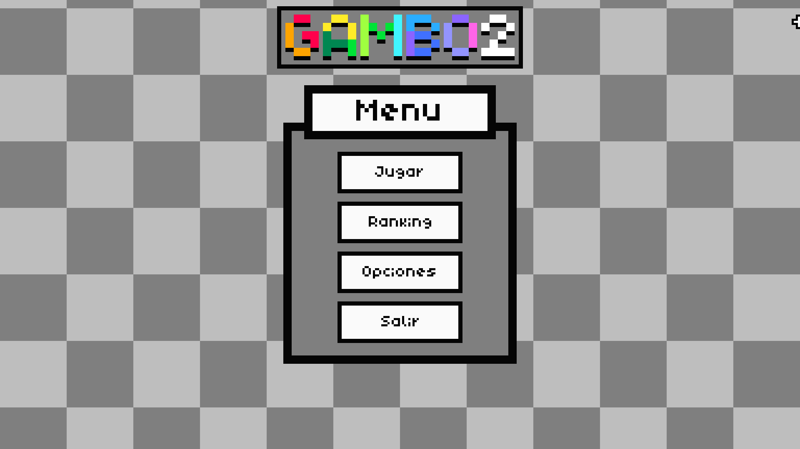
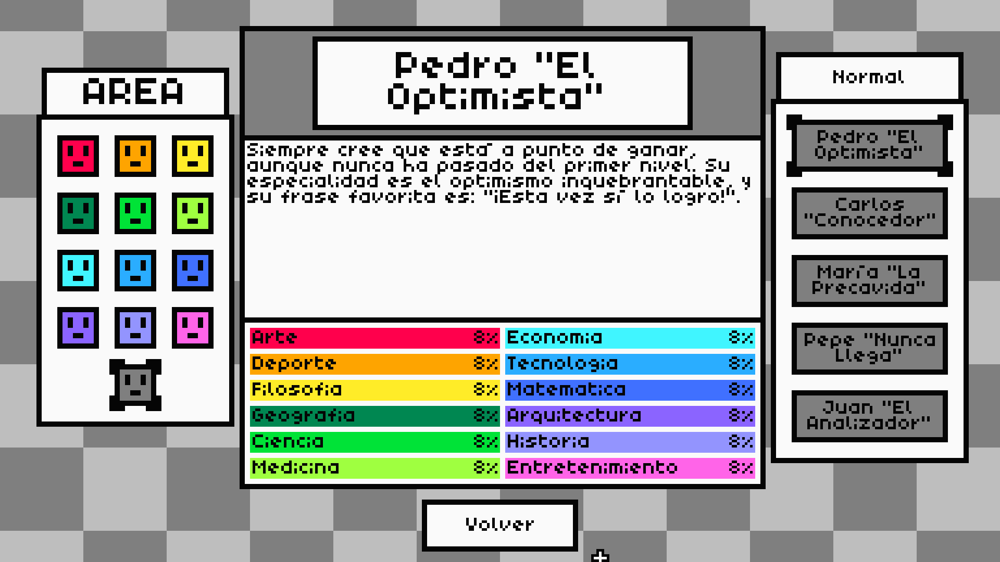
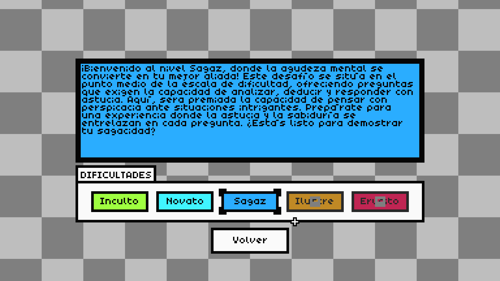
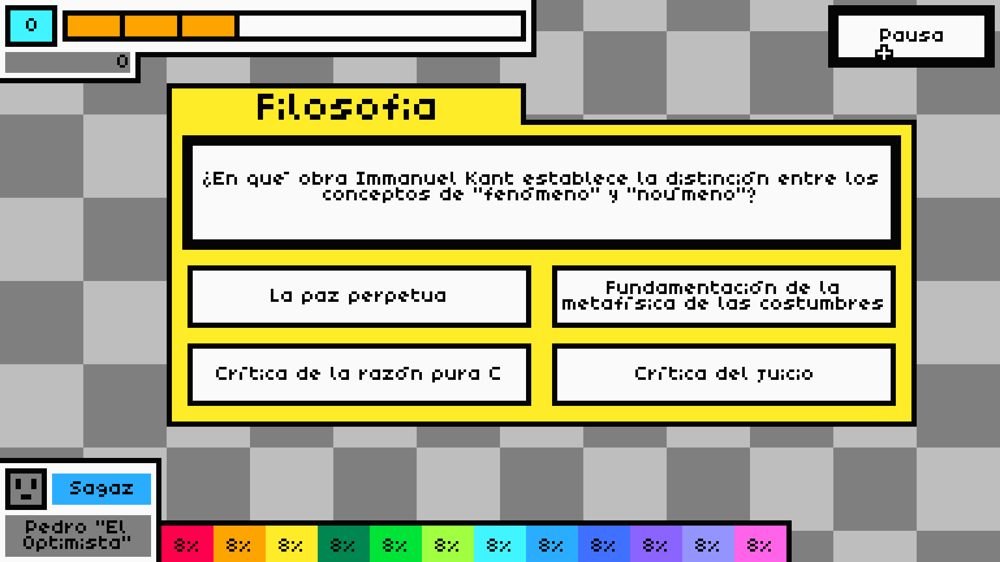

<h1 align = "center">
	
	 
	GAMBO 2
</h1>
 

A beautiful roguelike of questions developed in Python using Pygame_Tool_Kit.

## Description

Gambo 2 is a roguelike video game, which was developed in Python using Pygame_Tool_Kit. Created entirely by Gloacking, it is a knowledge quiz video game from various areas of knowledge, with more than 15 different characters, 12 topics, 5 difficulties, and 300 questions, it is a challenge that invites you to learn new things.

---

## Screenshots

---

## License

This project is licensed under the MIT License.

